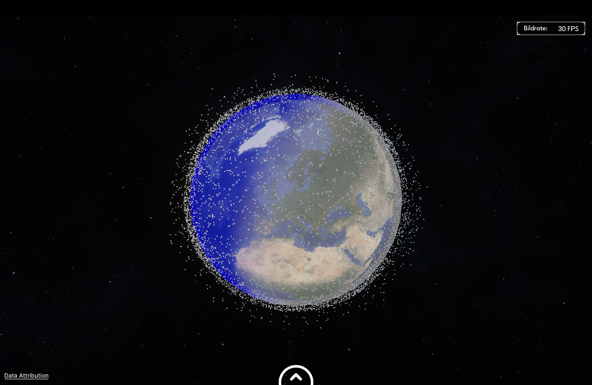

# Satellite Tracker Unity

Ein interaktives 3D-Satelliten-Visualisierungsprojekt für Unity, das Cesium for Unity nutzt, um Satelliten in Echtzeit
auf einem virtuellen Globus zu verfolgen.


*Screenshot der Weltraumansicht mit aktiven Satelliten*

## 🌍 Features

- **Echtzeit-Satellitenverfolgung**: Visualisierung von über 5000 aktiven Satelliten mit TLE-Daten von Celestrak
- **Interaktive Kamerasteuerung**: Nahtloser Übergang zwischen Weltraum- und Erdansicht
- **ISS-Tracking**: Spezielle Hervorhebung und Quick-Access für die Internationale Raumstation
- **Heatmap-Visualisierung**: Darstellung der Satellitendichte auf der Erdoberfläche
- **Tag/Nacht-System**: Realistische Beleuchtung mit Tag/Nacht-Zyklus
- **Ortssuche**: Schnelle Navigation zu Städten weltweit mit GeoNames-Datenbank
- **Satellitensuche**: Durchsuchbare Liste aller verfolgten Satelliten
- **Performance-optimiert**: GPU-Instancing und Job-System für flüssige Darstellung
- **Anpassbare UI**: Customizable Crosshair und Cursor-Designs

## 📋 Systemanforderungen

### Minimum

- **OS**: Windows 10 (64-bit), macOS 10.14+, Ubuntu 18.04+
- **Prozessor**: Intel Core i5-4590 / AMD FX 8350
- **Arbeitsspeicher**: 8 GB RAM
- **Grafik**: NVIDIA GTX 960 / AMD Radeon R9 280
- **DirectX**: Version 11
- **Speicherplatz**: 4 GB verfügbarer Speicherplatz
- **Internetverbindung**: Erforderlich für Cesium-Tiles und TLE-Updates

### Empfohlen

- **OS**: Windows 11, macOS 12+, Ubuntu 20.04+
- **Prozessor**: Intel Core i7-8700 / AMD Ryzen 5 3600
- **Arbeitsspeicher**: 16 GB RAM
- **Grafik**: NVIDIA GTX 1070 / AMD RX 5700
- **DirectX**: Version 12
- **Speicherplatz**: 8 GB verfügbarer Speicherplatz
- **Internetverbindung**: Breitband für optimale Tile-Streaming-Performance

## 🛠️ Technische Details

- **Unity Version**: 2022.3 LTS oder höher
- **Cesium for Unity**: Version 1.6.0+
- **Render Pipeline**: Universal Render Pipeline (URP)
- **Scripting Backend**: IL2CPP
- **.NET Version**: .NET Standard 2.1

## 🚀 Installation

### 1. Voraussetzungen

- Unity Hub installiert
- Git installiert (für Repository-Klonen)

### 2. Projekt Setup

```bash
# Repository klonen
git clone https://git.uni-jena.de/se47toc/UnitySeminar.git

# In Projektverzeichnis wechseln
cd UnitySeminar
```

### 3. Unity Projekt öffnen

1. Unity Hub öffnen
2. "Add" → Projektordner auswählen
3. Mit Unity 2022.3 LTS öffnen
4. Warten bis alle Packages importiert sind

## 🎮 Bedienung

### Kamerasteuerung

**Space-Modus (Weltraumansicht)**:

- **Linke Maustaste** gedrückt halten + Bewegen: Globus rotieren
- **Mausrad**: Zoom in/out
- **ESC**: Hauptmenü öffnen

**Earth-Modus (Nahansicht)**:

- **ESC**: Zwischen Inspektions- und Kameramodus wechseln
- Im Kameramodus:
    - **W/A/S/D**: Vorwärts/Links/Rückwärts/Rechts
    - **Maus**: Umsehen
    - **Shift**: Schnellere Bewegung
    - **Mausrad**: Vorwärts/Rückwärts
    - **R**: Zurück zur Ausgangsposition

### UI-Elemente

- **Space-Button**: Zurück zur Weltraumansicht
- **Suchleiste**: Orte auf der Erde suchen (Städte, Länder)
- **Satellite List**: Liste aller Satelliten durchsuchen
- **ISS-Button**: Schnellzugriff auf die ISS
- **Heatmap Toggle**: Satellitendichte-Visualisierung ein/aus
- **Show/Hide Toggle**: Satelliten ein-/ausblenden
- **Time Controls**:
    - Time Multiplier: Simulationsgeschwindigkeit (1x - 1000x)
    - Time Slider: Zeitpunkt einstellen (Mausrad zum Zoomen)
- **Altitude Slider**: Satelliten nach Höhe filtern (200km - 40.000km)
- **Settings**: Crosshair, Cursor, Audio und Grafikeinstellungen

## 🏗️ Projektstruktur

```
Assets/
├── Scripts/
│   ├── Satellites/           # Satelliten-Kernlogik
│   │   ├── SGP/             # SGP4 Orbit-Propagation
│   │   ├── Satellite.cs
│   │   ├── SatelliteManager.cs
│   │   ├── SatelliteOrbit.cs
│   │   └── SatelliteModelController.cs
│   ├── UI/                  # User Interface
│   │   ├── SearchPanelController.cs
│   │   └── SatelliteLabelUI.cs
│   ├── Lighting/            # Tag/Nacht-System
│   │   ├── DayNightSystem.cs
│   │   └── EarthDayNightOverlay.cs
│   ├── Heatmap/             # Dichtevisualisierung
│   ├── TimeSlider/          # Zeitsteuerung
│   └── CesiumZoomController.cs
├── Modelle/                 # 3D-Modelle/Materialien
```

### Hauptkomponenten

#### Core Systems

- **SatelliteManager**: Zentrale Verwaltung aller Satelliten, TLE-Updates, Job-System
- **CesiumZoomController**: Steuerung der Kameraübergänge zwischen Space/Earth-Modus
- **DayNightSystem**: Berechnung und Darstellung des Tag/Nacht-Zyklus

#### Kamera & Navigation

- **FreeFlyCamera**: First-Person-Kamerasteuerung für Erdansicht
- **GlobeRotationController**: Orbit-Kamerasteuerung um die Erde
- **IntroOrbitCamera**: Eingangs-Kameraanimation

#### Visualisierung

- **HeatmapController**: GPU-basierte Satellitendichte-Darstellung
- **EarthDayNightOverlay**: Shader-basierte Tag/Nacht-Grenze
- **SatelliteModelConroller**: Modelle basierend auf Ansicht ein/ausschalten

#### UI & Interaktion

- **SearchPanelController**: Satelliten-Suchfunktion mit Tracking
- **GeoNamesSearchFromJSON**: Performante Ortssuche
- **TimeSlider**: Zeitsteuerung mit Zoom-Funktion

## ⚙️ Konfiguration

### SatelliteManager

```csharp
// In Inspector anpassbar:
timeMultiplier = 60f;        // 1 Minute = 1 Sekunde
satelliteModelPrefabs        // Array mit 3D-Modellen
issModelPrefab              // Spezielles ISS-Modell
globalSpaceMaterial         // Space-Mode Material
```

### CesiumZoomController

```csharp
earthFov = 60f;             // Field of View für Erdansicht
spaceFov = 80f;             // Field of View für Weltraum
fovTransitionDuration = 2.3f; // Übergangszeit in Sekunden
sphereSize = 20000f;        // Größe der Satelliten im Space-Mode
```

### DayNightSystem

```csharp
sunIntensity = 1.3f;        // Sonnenlicht-Intensität
showTerminator = true;      // Tag/Nacht-Grenze anzeigen
shadowStrength = 0.9f;      // Schatten-Intensität
terminatorSoftness = 0.5f;  // Weichheit des Übergangs
```

### Performance Settings

```csharp
// HeatmapController
InfluenceRadius = 1_000_000f;  // Einflussbereich (Meter)
MaxDensityCount = 100f;        // Max. Dichte für Farbe

// SatelliteManager
maxVisibleSatellites = 5000;   // GPU-Instancing Limit
updateFrequency = 0.1f;        // Update-Rate (Sekunden)
```

## 🚀 Build-Anweisungen

### Windows Build

1. File → Build Settings
2. Platform: PC, Mac & Linux Standalone
3. Target Platform: Windows
4. Architecture: x86_64
5. Build

### macOS Build

1. File → Build Settings
2. Platform: PC, Mac & Linux Standalone
3. Target Platform: macOS
4. Architecture: Intel 64-bit + Apple silicon
5. Build

## 🐛 Troubleshooting

### Häufige Probleme

**Cesium Tiles werden nicht geladen**

- Internetverbindung prüfen
- Cesium Ion Token in Cesium Panel überprüfen
- Firewall-Einstellungen kontrollieren

**Niedrige FPS / Performance-Probleme**

- Satellite Count im SatelliteManager reduzieren
- Heatmap deaktivieren
- Grafikqualität in Settings reduzieren
- GPU-Treiber aktualisieren

**Fehler beim Projekt-Import**

- Package Manager → Refresh
- Library-Ordner löschen und neu generieren lassen
- Unity-Version überprüfen (2022.3 LTS)

## 📚 Weiterführende Ressourcen

- [Cesium for Unity Dokumentation](https://cesium.com/docs/cesium-for-unity/)
- [SGP4 Algorithmus Erklärung](https://celestrak.com/NORAD/documentation/)
- [TLE Format Spezifikation](https://celestrak.com/columns/v04n03/)
- [Unity Job System](https://docs.unity3d.com/Manual/JobSystem.html)

## 👥 Credits

- **Projektleitung**: Jan Vogt, Yannik Köllmann, Leon Erdhütter, Niklas Maximilian Becker-Klöster
- **Entwicklung**: Universitätsprojekt FSU Jena
- **Datenquellen**:
    - [CelesTrak](https://celestrak.org/) für TLE-Daten
    - [GeoNames](https://www.geonames.org/) für Ortsdatenbank
- **3D-Modelle**: Von NASA bereitgestellte Modelle